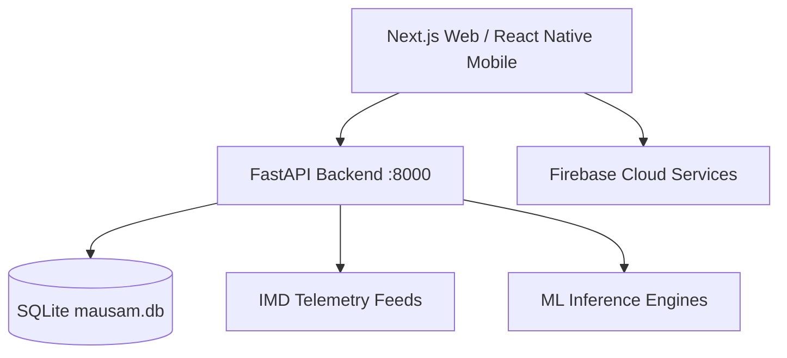

# System Architecture - MyMausam 2.0

## Overview
MyMausam 2.0 is built on a scalable, hybrid cloud architecture combining Next.js 16 (App Router), Python FastAPI, SQLite telemetry caching, and Firebase Cloud Functions.

